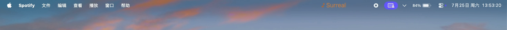
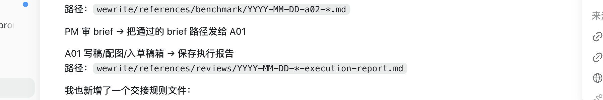
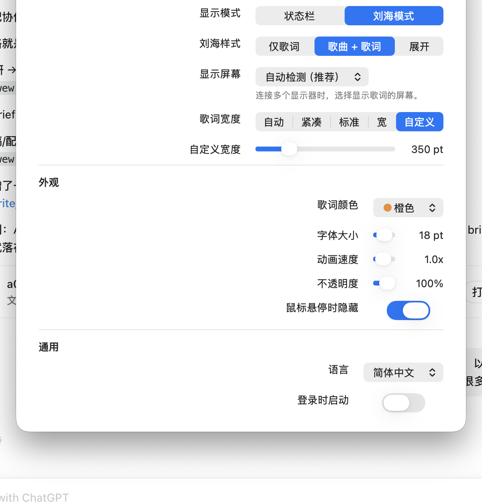

# NotchMuse

NotchMuse is a lightweight native macOS lyrics companion for Spotify. It shows synchronized lyrics in the menu bar or near the MacBook notch, with a small settings panel for display mode, width, color, font size, animation speed, opacity, and startup behavior.

NotchMuse is built for people who want lyrics to stay visible without opening a separate lyrics window.

## Demo Video

### Status Bar Mode

[Watch the Status Bar Mode demo](docs/assets/demos/notchmuse-status-bar-demo.mp4)



### Notch Mode

[Watch the Notch Mode demo](docs/assets/demos/notchmuse-notch-mode-demo.mp4)



### Settings



## Features

- Spotify now-playing detection through macOS automation
- Status Bar lyrics on the left or right side of the menu bar
- Notch Mode lyrics with Lyric Only, Song + Lyric, and Expanded styles
- Auto, Compact, Normal, Wide, and Custom lyrics width
- Built-in display, external display, and auto display targeting
- Long-line scrolling, synchronized lyric progress, and color presets
- Manual refresh, pause/resume handling, and single-instance launch behavior
- English and Simplified Chinese app interface
- Lyrics providers: LRCLIB, NetEase, LRCMux, QQ Music, Kugou, and Soda Music

## Installation

### Requirements

- macOS 14.0 or later
- Apple Silicon Mac
- Spotify desktop app for macOS

The current beta build is `arm64` only. Intel Mac and Universal Binary support are planned for a later phase.

1. Download `NotchMuse.dmg` from GitHub Releases.
2. Open the DMG.
3. Drag `NotchMuse.app` into `Applications`.
4. Open NotchMuse from `Applications`.
5. When macOS asks for permission to control Spotify, allow it.

### Beta Release Notice

This GitHub beta is distributed as an unsigned macOS build. macOS may ask you to confirm the first launch because the app is not signed with Apple Developer ID yet.

To open it:

1. In Finder, open `Applications`.
2. Control-click `NotchMuse.app`.
3. Choose `Open`.
4. Confirm `Open` again.

If macOS still blocks it, go to `System Settings > Privacy & Security` and choose `Open Anyway` for NotchMuse.

Developer ID signing and Apple notarization are deferred to a future Distribution Phase.

## Known Issues

- The beta is unsigned, so macOS Gatekeeper warnings are expected.
- Lyrics coverage depends on third-party providers.
- Word-by-word lyrics are not guaranteed; most providers return line-level timing.
- Left Status Bar mode requires Accessibility permission.
- Other menu bar management tools may hide the NotchMuse icon.
- Intel Mac is not supported in the current beta.

## Recommended Setup

For the cleanest Status Bar Mode experience, keep enough menu bar space available for lyrics. A menu bar organizer such as Thaw, Ice, Bartender, or a similar tool can help keep the right side of the menu bar uncluttered.

## Usage

1. Open Spotify and play a song.
2. Open NotchMuse.
3. Lyrics appear in the menu bar or notch area.
4. Use the menu bar note icon to open the control menu.
5. Open Settings to change display mode, position, color, width, font size, animation speed, opacity, and launch behavior.

If a menu bar organizer hides the NotchMuse icon, expand hidden menu bar items or open NotchMuse again to bring the menu back.

## Permissions

- Automation / Spotify: reads current track, playback state, and playback position.
- Accessibility: only needed for the left Status Bar layout so NotchMuse can avoid active app menu items.
- Network: queries public lyrics providers for the current song.

## Architecture

NotchMuse is a native Swift macOS menu bar app.

- `AppDelegate` owns app startup, single-instance behavior, Settings, and lifecycle coordination.
- `SpotifyReader` reads current Spotify playback through macOS automation.
- `LyricsClient` queries lyrics providers and returns synchronized lyrics.
- `MenuBarController` renders Status Bar lyrics.
- `OverlayLyricsWindow` renders Notch Mode lyrics.
- `SettingsWindowController` manages user preferences.
- `lyrics-provider-benchmark/` is an external benchmark lab used to measure provider coverage and matching quality.

The benchmark lab does not run inside the app. Its role is to identify provider and matching issues for future optimization.

## Lyrics Quality

The current benchmark lab tests a 1,000-track dataset against multiple lyrics providers.

Latest available snapshot:

- Dataset: `extended_1000`
- Successful matches: `636/1000`
- Coverage: `63.6%`
- Providers tested: LRCMux, LRCLIB, QQ Music, Soda Music, Kugou, NetEase

Known failure categories include network errors, artist mismatch, title mismatch, and version mismatch. Coverage depends on third-party services and should be treated as a quality snapshot, not a guarantee for every song.

## Build From Source

```sh
./scripts/build_app.sh
./scripts/build_dmg.sh
./scripts/build_release.sh 0.3.1 4
```

Build output:

```text
dist.noindex/NotchMuse.app
dist.noindex/NotchMuse.dmg
```

The default GitHub beta build is unsigned/ad-hoc signed. A future Developer ID build can be generated with:

```sh
NOTCHMUSE_SIGN_IDENTITY="Developer ID Application: Your Name (TEAMID)" ./scripts/build_dmg.sh
```

Manual release steps are tracked in [RELEASE_CHECKLIST.md](RELEASE_CHECKLIST.md).

## Test

```sh
swift run --package-path MenuBarLyrics NotchMuse --self-test
./scripts/run_live_matrix.sh
```

## Feedback

Please use [GitHub Issues](https://github.com/Xiye88/NotchMuse/issues) for feedback. Choose **Bug report** for reproducible problems and **Feature request** for focused use cases or improvements.

## Privacy

- No NotchMuse account is required.
- NotchMuse does not read or upload Spotify audio.
- NotchMuse does not collect telemetry, usage analytics, or personal profiles.
- Track title, artist, album, and duration may be sent to third-party lyrics providers for matching.
- Settings are stored locally with `UserDefaults`.

## License

NotchMuse is released under the MIT License. Third-party notices are listed in [THIRD_PARTY_NOTICES.md](THIRD_PARTY_NOTICES.md).
