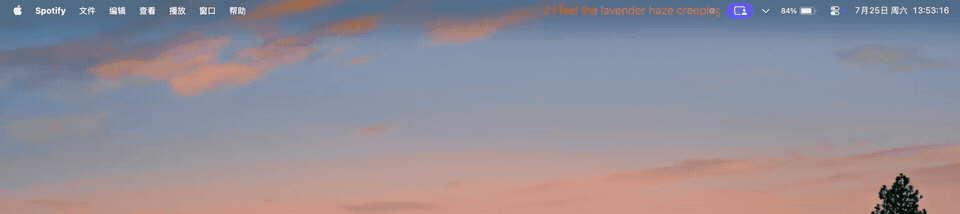
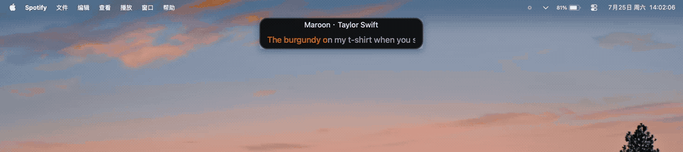

  <a href="README.md">English</a> | 简体中文

<h1 align="center">NotchMuse</h1>

  <strong>一款原生 macOS 应用，把同步歌词放到菜单栏和刘海区域。</strong>
   
  歌词在你需要的位置出现，不打断当前工作流。

  
  
  
  

  <a href="https://notchmuse.com"><strong>官方网站</strong></a> · <a href="https://github.com/Xiye88/NotchMuse/releases/download/v0.8.0-beta.2/NotchMuse.dmg"><strong>直接下载 v0.8.0 Beta 2</strong></a>
  ·
  <a href="https://github.com/Xiye88/NotchMuse/issues">报告问题</a>

  macOS 14+ · Apple Silicon · Spotify · Apple Music · 网易云音乐 · QQ 音乐 · 汽水音乐

> **当前公开 Beta：** [v0.8.0-beta.2](https://github.com/Xiye88/NotchMuse/releases/tag/v0.8.0-beta.2)，build 31。支持五个播放器、Auto Detect 和新版双语 Settings。新增美化安装包、双语首次打开指引和“隐私与安全性”快捷入口。ad-hoc 签名，尚未公证。可从 [notchmuse.com](https://notchmuse.com) 直接下载。

## 演示

### Status Bar Mode

使用其他应用时，歌词会保持显示在 macOS 菜单栏中。

### Notch Mode

歌曲信息和同步歌词会显示在 MacBook 刘海下方。

## 为什么是 NotchMuse？

- 工作时保持同步歌词可见，不需要切换到单独的歌词窗口。
- 可选择紧凑菜单栏显示，也可选择 MacBook 刘海布局。
- 原生、轻量，不需要 NotchMuse 账号，也不收集遥测数据。

## 功能

| **播放器检测** | **刘海歌词** |
| --- | --- |
| 支持 Spotify、Apple Music、网易云音乐、QQ 音乐和汽水音乐。默认使用 Auto Detect，也可手动选择播放器。 | 在刘海附近选择 Lyric Only、Song + Lyric 或 Expanded 布局。 |
| **内置播放信息 bridge** | **重视隐私** |
| MediaRemote bridge 已随应用打包，无需安装 Homebrew。网易云、QQ 音乐和汽水音乐依赖 macOS 私有 MediaRemote API，系统或播放器更新后可能需要适配。 | 不需要账号，不收集遥测数据，不上传音频。内置 English 和简体中文。 |

## 截图

### 完整 Mac 场景

Spotify 播放时，NotchMuse 可以在真实 macOS 工作区中保持可见。

### Status Bar Mode

工作时，同步歌词保持显示在 macOS 菜单栏中。

### Notch Mode

歌词以紧凑、可扫视的布局显示在 MacBook 刘海附近。

### Settings

新版 Settings 包含 Sidebar、状态栏/刘海实时预览、外观预设及显示设置。下图为早期版本截图。

## 快速开始

当前公开的 v0.8.0 Beta 2 支持 Spotify、Apple Music、网易云音乐、QQ 音乐和汽水音乐。

1. 访问 [官网](https://notchmuse.com)，或[直接下载 Beta 2 DMG](https://github.com/Xiye88/NotchMuse/releases/download/v0.8.0-beta.2/NotchMuse.dmg)。
2. 打开 DMG，把 `NotchMuse.app` 拖到 `Applications`。
3. 这个 beta 尚未 notarize：按住 Control 点击 `NotchMuse.app`，选择 `Open`，再确认 `Open`。
4. 打开五个支持的桌面播放器之一并播放歌曲。
5. 在 Settings 保留 Auto Detect 或手动选择播放器；Spotify 或 Apple Music 提示权限时，允许 macOS Automation。
6. 在菜单栏里找到橙色音符图标。
7. 打开 Settings，选择 Status Bar Mode 或 Notch Mode。

## 安装

### 系统要求

- macOS 14.0 或更高版本
- Apple Silicon Mac
- Spotify、Apple Music、网易云音乐、QQ 音乐或汽水音乐桌面应用

当前 Beta 仅支持 `arm64`，暂不支持 Intel Mac。

应用已内置 MediaRemote bridge，无需另装 Homebrew 或 helper。网易云、QQ 音乐和汽水音乐依赖私有 MediaRemote API，系统或播放器更新后可能需要适配。

1. 从[官网](https://notchmuse.com)下载带版本号的 DMG。
2. 打开 DMG。
3. 把 `NotchMuse.app` 拖到 `Applications`。
4. 从 `Applications` 打开 NotchMuse。
5. 当 macOS 询问是否允许控制当前音乐播放器时，选择允许。

### Beta 签名说明

这个 GitHub beta 已进行 ad-hoc signing，但尚未使用 Apple Developer ID 签名或 notarize。macOS 首次启动时可能会要求你确认。

打开方式：

1. 在 Finder 中打开 `Applications`。
2. 按住 Control 点击 `NotchMuse.app`。
3. 选择 `Open`。
4. 再次确认 `Open`。

如果 macOS 仍然拦截，前往 `System Settings > Privacy & Security`，为 NotchMuse 选择 `Open Anyway`。

Developer ID 签名和 Apple 公证暂未配置。当前版本为面向用户测试的公开 Beta。

如果安装、Gatekeeper、音乐播放器 Automation permission 或歌词查询失败，请查看 [SUPPORT.md](SUPPORT.md)。

## 可选菜单栏设置

NotchMuse 不要求安装菜单栏整理工具。如果你的菜单栏已经很拥挤，可以选择 Ice、Thaw 或 Bartender 等工具，为 Status Bar Mode 腾出空间。

## 已知问题

- beta 尚未使用 Apple Developer ID 签名或 notarize，因此 macOS Gatekeeper 警告是预期行为。
- 歌词覆盖率依赖第三方 provider。
- 网易云、QQ 音乐和汽水音乐依赖 macOS 私有 MediaRemote API，系统或播放器更新后可能需要适配。
- 不保证逐字歌词；多数 provider 返回的是逐行时间轴。
- Left Status Bar mode 需要 Accessibility permission。
- 其他菜单栏管理工具可能隐藏 NotchMuse 图标。
- 当前 beta 不支持 Intel Mac。

## 路线图

- 当前公开 Beta：v0.8.0-beta.2，五平台、Auto Detect、Settings UI v2 和新版安装包
- 下一阶段：新设备验证，以及真实 Beta 用户反馈修复
- 后续分发与兼容性工作根据验证结果决定

## 使用

1. 打开 Spotify、Apple Music、网易云音乐、QQ 音乐或汽水音乐并播放歌曲。
2. 打开 NotchMuse。
3. 歌词会显示在菜单栏或刘海区域。
4. 使用菜单栏音符图标打开控制菜单。
5. 保留 Auto Detect 或手动选择五个播放器之一。打开 Settings 调整显示与外观设置。

如果菜单栏整理工具隐藏了 NotchMuse 图标，请展开隐藏的菜单栏项目，或重新打开 NotchMuse 让菜单回来。

## 权限

- Automation / Spotify 或 Apple Music：读取当前曲目、播放状态和播放位置。
- 网易云音乐、QQ 音乐、汽水音乐：通过内置私有 MediaRemote bridge 读取播放信息。
- Accessibility：仅 Left Status Bar 布局需要，用于避开当前应用的菜单项。
- Network：为当前歌曲查询公开歌词 provider。

## 反馈

安装和使用问题请先查看 [SUPPORT.md](SUPPORT.md)。反馈请阅读 [FEEDBACK.md](FEEDBACK.md)，然后使用 [GitHub Issues](https://github.com/Xiye88/NotchMuse/issues)。可复现问题请选择 **Bug report**，具体使用场景或改进建议请选择 **Feature request**。

## 隐私

- 不需要 NotchMuse 账号。
- NotchMuse 不读取或上传任何支持播放器的音频。
- NotchMuse 不收集遥测数据、使用分析或个人资料。
- 曲名、artist、album 和时长可能会发送给第三方歌词 provider 用于匹配。
- 设置使用 `UserDefaults` 保存在本地。

## 开发者文档

架构、构建与测试、Lyrics Quality Benchmark、Evidence Gate、Matcher 设计和 Provider 分析统一收录在 [Developer Documentation](docs/README.md)。

## 许可证

NotchMuse 使用 MIT License 发布。第三方声明列在 [THIRD_PARTY_NOTICES.md](THIRD_PARTY_NOTICES.md)。

当前 Beta 内置 BSD-3-Clause 许可的 MediaRemote Adapter bridge；固定源码版本与署名信息记录在第三方声明中，无需安装 Homebrew。
