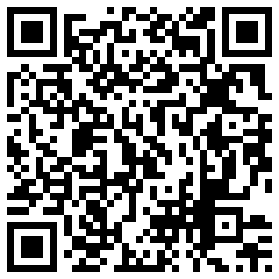
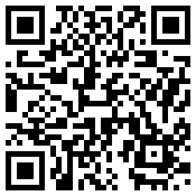

<a href="README.md">English</a> | 简体中文

<h1 align="center">NotchMuse v0.8.0</h1>

把同步歌词放在 Mac 菜单栏、刘海旁，或屏幕边缘。

macOS 14+ · Apple Silicon · Spotify · Apple Music · 网易云音乐 · QQ 音乐 · 汽水音乐

<a href="https://notchmuse.com"><strong>官网下载</strong></a> · <a href="https://github.com/Xiye88/NotchMuse/releases"><strong>GitHub Release</strong></a> · <a href="https://github.com/Xiye88/NotchMuse/issues"><strong>报告问题</strong></a>

## 支持的播放器

Spotify · Apple Music · 网易云音乐 · QQ 音乐 · 汽水音乐。可以手动选择，也可以让自动检测跟随当前正在播放的应用。

## 核心功能

| 歌词位置 | 个性化 | 日常使用 |
| --- | --- | --- |
| 菜单栏、刘海歌词 | 纯色与渐变色 | 自动检测播放器 |
| 屏幕左侧或右侧 | 背景、透明度、宽度 | 简体中文与 English |
| Dock 上方歌词 | 外观预设 | 应用内更新设置 |
| 自定义宽度与位置 | 跟随系统、浅色与深色外观 | 开机自动启动；Dock 与菜单栏图标控制 |

网易云、QQ 音乐和汽水音乐使用随应用打包的 MediaRemote bridge，无需 Homebrew 或额外安装 helper。macOS 或播放器升级后可能需要兼容性更新。

## 界面截图

<!-- SCREENSHOT_REFRESH_PENDING_PO: 补入 v0.8.0 Settings、菜单栏、刘海、侧边和 Dock 新截图；不得复用旧 Settings 截图。 -->

新版图集正在整理。目前可先看[菜单栏演示](docs/assets/demos/notchmuse-status-bar-demo.mp4)和[刘海演示](docs/assets/demos/notchmuse-notch-mode-demo.mp4)。

## 三步开始

1. 从[官网](https://notchmuse.com)下载 DMG，打开后将应用拖入“应用程序”。
2. 用任一支持的桌面播放器播放歌曲；Spotify 或 Apple Music 请求自动化权限时请允许。
3. 打开 NotchMuse，保留“自动检测”，在设置中选择歌词位置。

## 安装与安全提示

NotchMuse 通过官网和 GitHub 直接分发，目前尚未配置 Apple Developer ID 签名与公证。因此 macOS 首次打开时可能出现安全提示。这属于分发签名状态，与版本状态无关。

如果系统拦截，请打开 **系统设置 → 隐私与安全性 → 仍要打开**，按提示认证后再次启动。安装和权限问题见[使用支持](SUPPORT.md)。目前不支持 Intel Mac。

## 自动更新

从 v0.8.0 开始，在 **设置 → 通用 → 检查更新…** 中发现、下载并安装签名更新。关闭自动检查不会禁用手动检查。Sparkle 在安装和重启前验证更新包的 EdDSA 签名。

如果你正在使用 Beta 3 或更早版本，请手动下载安装一次 v0.8.0。旧版本不包含更新器。

## 常见问题

**某首歌没有歌词？** 歌词取决于第三方歌词来源覆盖率；支持播放器不代表每首歌都能匹配。

**会上传音频吗？** 不会。应用读取播放元数据，可能将歌名、歌手、专辑和时长发送给歌词来源用于匹配；不收集遥测，也不要求注册账号。

**菜单栏图标不见了？** 其他菜单栏工具可能将它隐藏。NotchMuse 不管理其他应用的菜单栏图标。

## 支持 NotchMuse

应用内提供 Support 页面，也可以使用以下二维码：

| 微信支付 | USDT · EVM | USDT · TRON |
| --- | --- | --- |
|  |  |  |

EVM 地址支持 Ethereum、BNB Smart Chain (BEP20)、Arbitrum 和 Optimism；TRON 使用独立 TRC20 地址。转账前请核对网络，并且只发送 USDT。[支持者名单](docs/support/supporters.json)仅展示已同意公开的信息。

## 许可与反馈

NotchMuse 使用 MIT License；内置第三方组件见[第三方声明](THIRD_PARTY_NOTICES.md)。使用问题请看[支持文档](SUPPORT.md)和[反馈指南](FEEDBACK.md)，或直接[提交 Issue](https://github.com/Xiye88/NotchMuse/issues)。架构与构建文档见 [docs/README.md](docs/README.md)。
